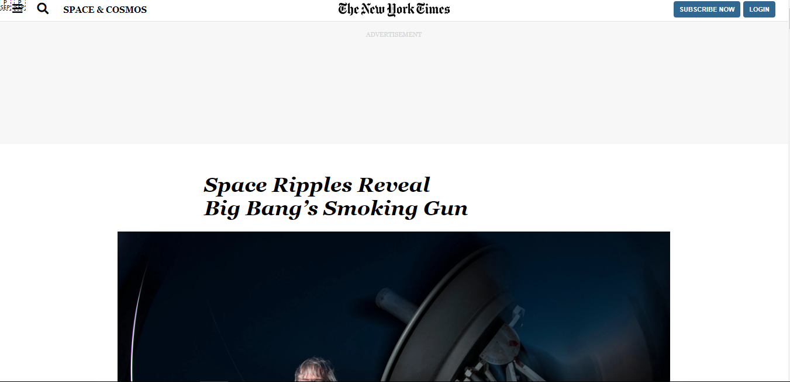

# NewYork-Times Clone

> Recreating the New-York Times Page

> 

## Built With

- HTML &,
- CSS,

## Live Demo

[Live Demo Link](https://rawcdn.githack.com/imahnama/NewYork-Times-Page/371cee6e9712c6afae9f234373400f2b0263f39d/index.html)

## Getting Started

To get a local copy up and running follow these simple example steps.

### Prerequisites

A browser of your choice preferrably Chrome.

### Setup

Fork this project to your local machine

## Authors

👤 **Eric Mbouwe**

- Github: [@EricMbouwe](https://github.com/EricMbouwe)
- Twitter: [@EricMbouwe](https://mobile.twitter.com/EricMbouwe)
- Linkedin: [Eric Mbouwe](https://www.linkedin.com/mwlite/in/ericmbouwe)

👤 **Rahma Halane**

- Github: [@Imahnama](https://github.com/imahnama)
- Twitter: [@halane_rahma](https://twitter.com/halane_rahma)
- Linkedin: [Rahmahalane](https://linkedin.com/Rahmahalane)

## 🤝 Contributing

Contributions, issues and feature requests are welcome!

Feel free to check the [https://github.com/imahnama/NewYork-Times-Page/issues](issues/).

## Show your support

Give a ⭐️ if you like this project!!

## Acknowledgments

- Freecodecamp
- https://www.w3schools.com/howto/howto_css_image_text.asp

## 📝 License

No License
